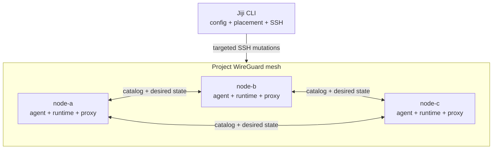
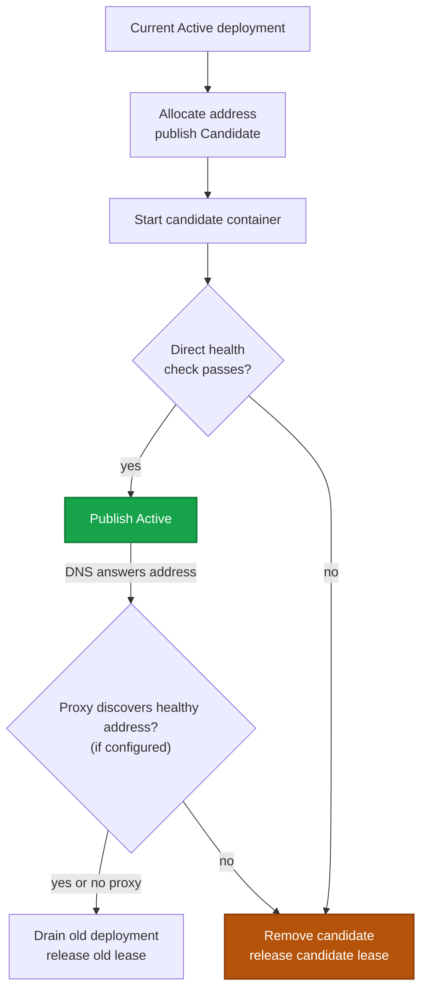
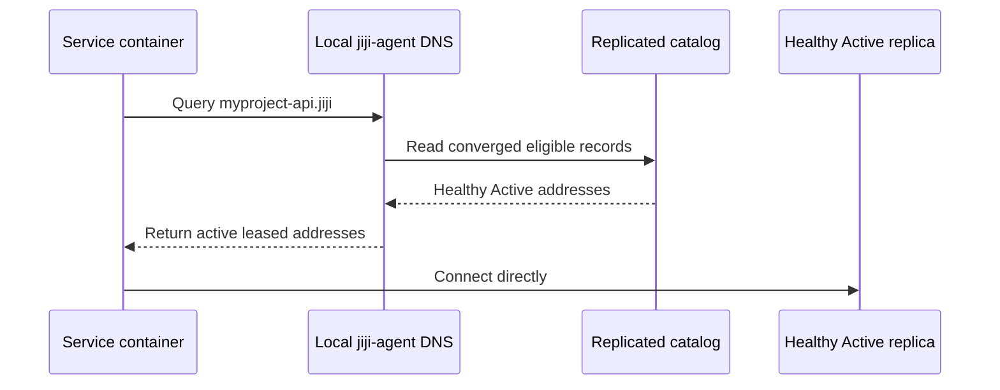

export const metadata = {
  description: 'Understand the Jiji CLI, distributed project agents, dynamic deployments, WireGuard mesh, DNS, and proxy routing.',
  alternates: { canonical: '/docs/getting-started/architecture' },
  openGraph: { url: '/docs/getting-started/architecture', images: ['/docs/opengraph-image.png'] }
}

# Architecture

## System Overview

You run the Rust `jiji` CLI from a laptop or CI. It loads `deploy.yml`,
validates intent, selects the owners affected by a command, and connects over
SSH. Each server runs a small per-project `jiji-agent` that maintains durable
distributed state and answers private DNS.



Everything except jiji-proxy is project-scoped. Independent projects on one
host get different WireGuard interfaces and ports, bridges, agent units,
state, sockets, DNS addresses, and replication ports. jiji-proxy is a shared
host-global container attached to each project bridge that owns routes there.

## Core Components

### Jiji CLI

Plans deployments and placement, uploads configuration and binaries, acquires
locks only on mutation owners, and drives transactional service changes. It is
not a central control plane and does not need to remain running.

### jiji-agent

One root-owned process per project and server:

- receives membership pushed directly over SSH by the CLI and repairs its
  own WireGuard peers from it;
- stores desired placement and service catalog operations, continuously
  replicated peer-to-peer with other agents;
- allocates and quarantines dynamic container address leases;
- discovers labeled containers and reconciles local observations;
- serves authoritative UDP and TCP `.jiji` DNS, forwarding any other query
  to `network.dns_forwarders`;
- restores durable state after process or host restart.

### WireGuard and project bridge

WireGuard carries management and routed container-subnet traffic between
servers. Each server owns one project container subnet. Docker or Podman
containers use explicit leased addresses on that bridge.

### jiji-proxy

The shared reverse proxy terminates HTTP/TLS and, via its own continuous DNS
resolution against the project's `.jiji` zone, routes to every healthy Active
deployment in the replicated catalog. Backends can be local or on another
host in the mesh. Candidate deployments are checked directly before they are
admitted.

## Deployment Flow

Logical replicas have stable IDs. Every replacement has a unique deployment
ID, container name, and address lease:



If health or proxy reconciliation fails, the previous Active deployment
remains in service.

`stop_first` uses a separate singleton transaction for workloads that cannot
run two containers at once.

## Placement and Scaling

`services.*.servers` is the literal deploy target list: every listed server
gets a deployment. `scale` is the instance count on *each* listed server, not
a total across them. Runtime overrides are replicated desired state:

```bash
jiji service scale 4 -S web
jiji service scale --reset -S web
```

Scale writes desired placement first, then converges containers, DNS, and
proxy routes. Interrupted work is retried with the same command. Scale-to-zero
withdraws DNS and ingress before leaving no service containers.

## Service Discovery



Candidate, Draining, Stopped, Tombstoned, unhealthy, and unreachable-owner
records are excluded. DNS updates follow catalog replication and never require
a cluster-wide network regeneration.

## Failure Model

Durable membership, desired placement, catalog history, and leases survive
agent restart. Liveness is a reversible eligibility overlay: an unreachable
owner can be suppressed from DNS without deleting its durable records.
Explicit authenticated tombstones, not timeouts, remove ownership.

The CLI enrolls a new server by connecting to it directly over SSH, with no
dependency on any other host's availability. Ordinary deploy and scale
commands do not require every mesh member to be reachable.

## Security and Ports

- SSH keys, ssh-agent, or inline keys authenticate CLI access.
- Membership has no signature: the CLI pushes it directly over SSH, so a
  host's trust boundary is that the file was installed by root. Catalog and
  desired records carry no signature either; a receiver authenticates an
  inbound record by resolving the connection's source address against its
  local membership view, which WireGuard's own peer authentication makes
  unspoofable within the mesh.
- Secrets are staged in remote `--env-file` files, not command-line `-e`
  values.
- WireGuard encrypts management and container traffic.

| Port | Protocol | Purpose |
|---|---|---|
| 22 | TCP | SSH |
| 80/443 | TCP | Public HTTP/HTTPS |
| Configured `listen_port` values | TCP | Public raw TCP proxy routes |
| 51820-55819 | UDP | Project-specific WireGuard |
| Project-derived | TCP | Catalog and desired-state replication over the mesh (membership has no port of its own; it's pushed over SSH) |

See the [Network Reference](/docs/reference/network) for address, naming, and
recovery details.
