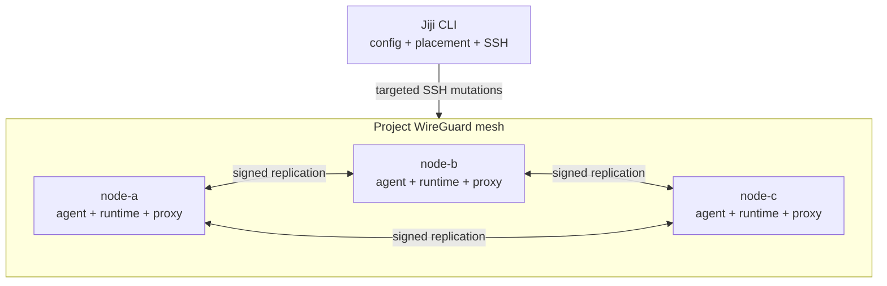
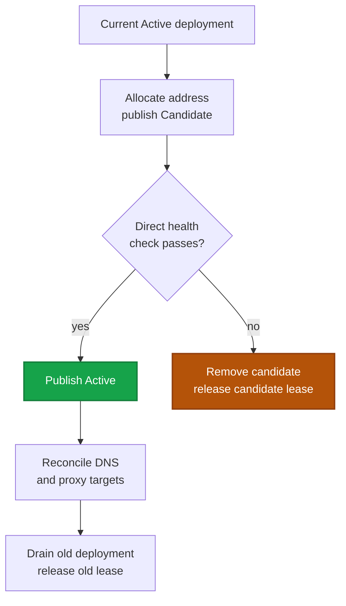
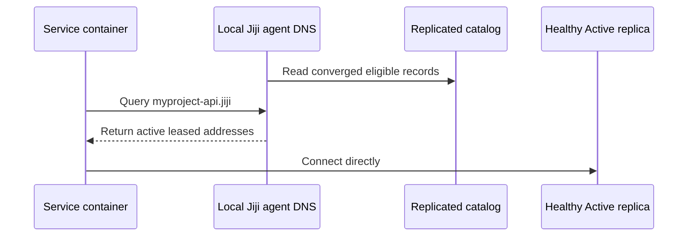

export const metadata = {
  description: 'Understand the Jiji CLI, distributed project agents, dynamic deployments, WireGuard mesh, DNS, and proxy routing.',
  alternates: { canonical: '/docs/getting-started/architecture' },
  openGraph: { url: '/docs/getting-started/architecture', images: ['/docs/opengraph-image.png'] }
}

# Architecture

## System overview

You run the Rust `jiji` CLI from a laptop or CI. It loads `deploy.yml`,
validates intent, selects the owners affected by a command, and connects over
SSH. Each server runs a small per-project `jiji-agent` that maintains durable
distributed state and answers private DNS.



Everything except kamal-proxy is project-scoped. Independent projects on one
host get different WireGuard interfaces and ports, bridges, agent units,
state, sockets, DNS addresses, and replication ports. Kamal-proxy is a shared
host-global container attached to each project bridge that owns routes there.

## Core components

### Jiji CLI

Plans deployments and placement, uploads configuration and binaries, acquires
locks only on mutation owners, and drives transactional service changes. It is
not a central control plane and does not need to remain running.

### Jiji agent

One root-owned process per project and server:

- authenticates and replicates mesh membership;
- stores signed desired placement and service catalog operations;
- allocates and quarantines dynamic container address leases;
- discovers labeled containers and reconciles local observations;
- serves authoritative UDP and TCP `.jiji` DNS, forwarding any other query
  to `network.dns_forwarders`;
- restores durable state after process or host restart.

### WireGuard and project bridge

WireGuard carries management and routed container-subnet traffic between
servers. Each server owns one project container subnet. Docker or Podman
containers use explicit leased addresses on that bridge.

### kamal-proxy

The shared reverse proxy terminates HTTP/TLS and routes to every healthy Active
deployment in the replicated catalog. A route can contain local and remote
targets. Candidate deployments are checked directly before they are admitted.

## Deployment flow

Logical replicas have stable IDs. Every replacement has a unique deployment
ID, container name, and address lease:



If health or proxy reconciliation fails, the previous Active deployment
remains in service.

`stop_first` uses a separate singleton transaction for workloads that cannot
run two containers at once.

## Placement and scaling

`services.*.servers` defines eligible owners. `replicas` is the total count,
and `placement` is `spread` or `packed`. Runtime overrides are signed,
replicated desired state:

```bash
jiji service scale -S web --replicas 4
jiji service scale -S web --reset
```

Scale writes desired placement first, then converges containers, DNS, and
proxy routes. Interrupted work is retried with the same command. Scale-to-zero
withdraws DNS and ingress before leaving no service containers.

## Service discovery



Candidate, Draining, Stopped, Tombstoned, unhealthy, and unreachable-owner
records are excluded. DNS updates follow catalog replication and never require
a cluster-wide network regeneration.

## Failure model

Durable membership, desired placement, catalog history, and leases survive
agent restart. Liveness is a reversible eligibility overlay: an unreachable
owner can be suppressed from DNS without deleting its durable records.
Explicit authenticated tombstones, not timeouts, remove ownership.

The CLI can enroll a new server through one reachable seed. Ordinary deploy
and scale commands do not require every mesh member to be reachable.

## Security and ports

- SSH keys, ssh-agent, or inline keys authenticate CLI access.
- Membership is authority-signed; catalog and desired records are signed by
  active member nodes.
- Secrets are staged in remote `--env-file` files, not command-line `-e`
  values.
- WireGuard encrypts management and container traffic.

| Port | Protocol | Purpose |
|---|---|---|
| 22 | TCP | SSH |
| 80/443 | TCP | Public HTTP/HTTPS |
| 51820-55819 | UDP | Project-specific WireGuard |
| Project-derived | TCP | Membership and catalog replication over the mesh |

See the [Network Reference](/docs/reference/network) for address, naming, and
recovery details.
