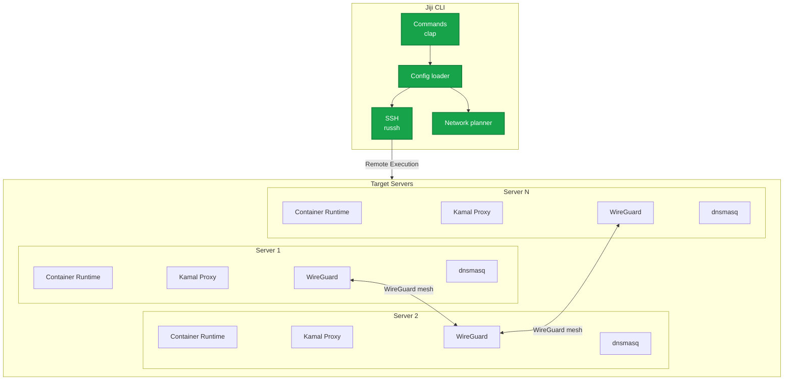
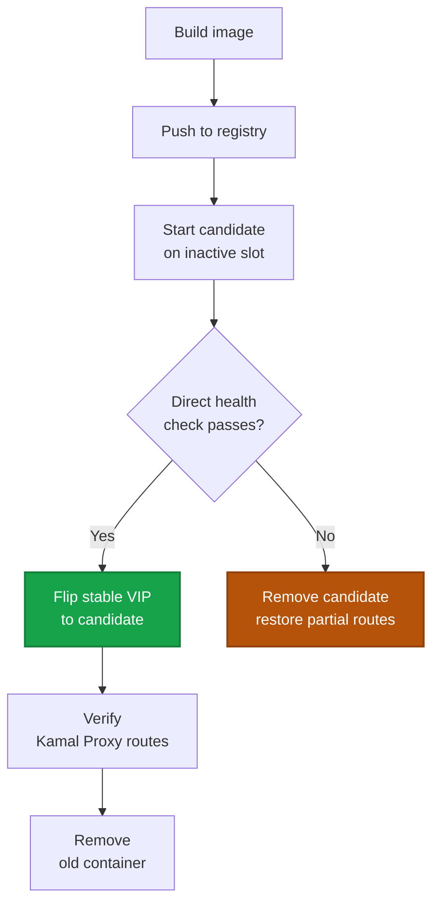
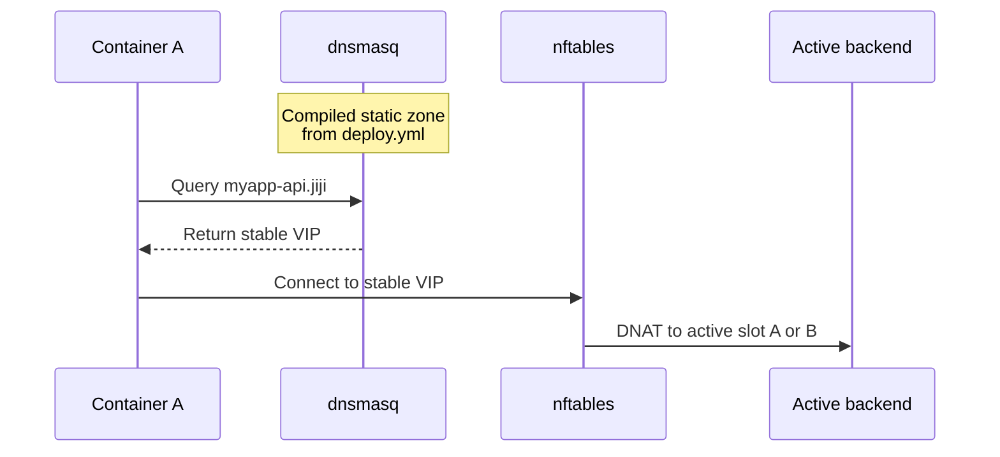

export const metadata = {
  description: 'Understand how Jiji plans deployments, connects over SSH, and configures containers, networking, and service discovery.',
  alternates: { canonical: '/docs/getting-started/architecture' },
  openGraph: { url: '/docs/getting-started/architecture', images: ['/docs/opengraph-image.png'] }
}

# Architecture

## System Overview

Jiji is a single Rust binary you run from your laptop or CI. It reads
`deploy.yml`, works out the network topology and container placement, and
pushes changes to your servers over SSH. Nothing runs as a background
service on your end, and the servers don't run any jiji-specific daemon
either - WireGuard, dnsmasq, and nftables are just doing their normal jobs
with config jiji wrote for them.

Every resource on a server except kamal-proxy is scoped to one `project:` -
two independent projects can run `jiji server setup` against the same
physical host and get two fully isolated sets of the above, each with its
own WireGuard interface, bridge network, and DNS resolver. See
[Network Reference](/docs/reference/network) for the exact naming rules.

### Core Capabilities

- **Zero-downtime deployments** with health checks and automatic rollback
- **Private networking** - per-project WireGuard mesh with automatic `.jiji`
  DNS service discovery
- **Registry management** - local loopback registry or remote (GHCR, Docker
  Hub, custom)
- **Parallel SSH orchestration** across many servers at once
- **Deployment locks and an append-only audit trail** for every
  state-changing command

### Technology Stack

- **Language/runtime** - Rust, compiled to a single static binary (`jiji`)
- **CLI framework** - clap
- **SSH** - russh (pure-Rust async SSH client; no subprocess, no libssh FFI)
- **Container Runtime** - Docker or Podman
- **Networking** - WireGuard, routed container bridges, dnsmasq, nftables

### Architecture Principles

1. **Zero downtime** - old containers keep serving until new ones are healthy
2. **Idempotent operations** - commands can be re-run safely
3. **Fail safe** - a failed operation doesn't leave the system half-changed
4. **Distributed first** - built for multi-server deployments, not bolted on
5. **Configuration as code** - infrastructure is fully described in YAML

## Component Details

### Jiji CLI

Runs on your machine or CI. Every command follows the same sequence: load
config, validate it, build the network plan, pick target hosts, connect over
SSH, run the work, close the connections. Each invocation opens its own SSH
sessions and closes them when it's done - there's no persistent process or
connection cache sitting between runs.

### Container Runtime

Docker or Podman on each target server. Jiji is runtime-agnostic and
detects/uses whichever is installed.

### kamal-proxy

The one component that's deliberately shared across projects on a host: a
single HTTP/HTTPS reverse proxy container, multi-homed onto every project's
bridge network that has active routes on that host. Handles SSL/TLS
termination and health-check-gated routing to whichever backend slot is
currently active.

### WireGuard

A per-project encrypted mesh VPN between servers:

- Each project gets its own WireGuard interface and UDP port (derived
  deterministically from the project name, not a single fixed port)
- Peer configuration is fully automatic
- Two independent projects on the same host get two independent meshes

### dnsmasq

Per-project DNS resolver serving compiled `.jiji` records:

- `{project}-{service}.jiji` resolves to the stable VIPs of all replicas
- `{project}-{service}-{server}.jiji` resolves to one specific replica
- Records are compiled from `deploy.yml` when the network is set up, so they
  describe what's configured, not what's currently healthy. Health checks
  are handled separately, by gating the VIP switch during deploys.

## Deployment Flow

Each service endpoint gets two fixed backend addresses (slots A and B) and
one stable VIP, worked out up front from config. The candidate container
always starts on whichever slot isn't currently active, and the VIP only
moves over once that candidate passes its health check - no renaming
containers mid-deploy, no downtime window while traffic is redirected.

If the health check fails, the previous container is never touched and
keeps serving traffic - the candidate and any partial proxy routes are
rolled back instead.

## Network Architecture

Full naming rules and the per-project isolation model are documented in
[Network Reference](/docs/reference/network); this is a summary.

### Service Discovery Flow

DNS just answers with whatever's configured; it doesn't need to know which
container is currently healthy. That job belongs to the VIP switch during
deploys, which only happens after a direct health check passes.

## Security Model

### Network Security

- WireGuard encryption with Curve25519, perfect forward secrecy
- Containers isolated inside their project's private network, not directly
  reachable from the internet
- Exposed only through kamal-proxy or explicit port mappings

### Authentication

- SSH keys, ssh-agent, or inline key data for server access
- Registry authentication with tokens or username/password
- Secrets loaded from `.env` files, uploaded to remote hosts via a staged
  `--env-file` (never inlined into a logged `-e KEY=VALUE` command), with
  optional host-env fallback via `--host-env`

### Firewall Requirements

| Port | Protocol | Purpose |
|------|----------|---------|
| 22 | TCP | SSH |
| 80/443 | TCP | HTTP/HTTPS |
| 51820-55819 | UDP | WireGuard (one port per project, not a single fixed port) |

Service discovery and VIP routing both happen locally on each host, so
there's no extra gossip or database port to open.
