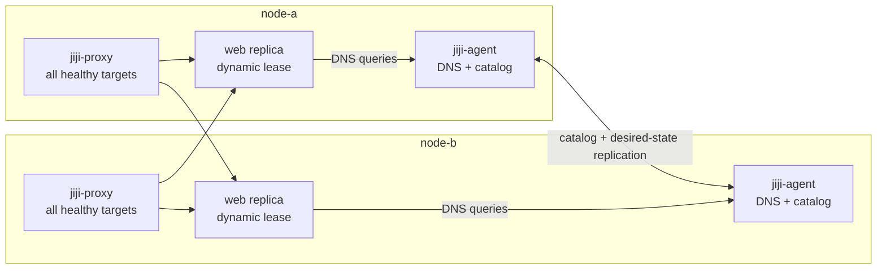

export const metadata = {
  description: 'Reference for Jiji WireGuard networking, distributed DNS, dynamic service addressing, and recovery behavior.',
  alternates: { canonical: '/docs/reference/network' },
  openGraph: { url: '/docs/reference/network', images: ['/docs/opengraph-image.png'] }
}

# Network Reference

Jiji creates a project-isolated WireGuard mesh. Each server owns a routed
container subnet and runs a per-project agent. Agents replicate desired
placement, the service catalog, and DNS data directly over the mesh
(membership is pushed separately, over SSH by the CLI, not agent-to-agent).
There is no central coordinator.



## Project Isolation

Every project derives its own WireGuard interface, UDP port, bridge, agent
unit, state directory, Unix socket, DNS address, and replication ports from
`project:`. Multiple projects can share a physical server. jiji-proxy is the
one host-global component and is attached to each project bridge that owns
routes on that host.

Jiji derives a `/24` management range and `/16` container range from
`project:`. Sixty-four default range slots exist, so this is not a global
allocator. Before a network change, Jiji checks host routes and active range
markers from other projects on the host. Configure explicit non-overlapping
CIDRs for a LAN, VPN, cloud VPC, or reported project collision.

The current control-plane limit is 32 servers per project. Configuration
validation also limits a project to 500 services and 2,000 logical replicas.
These are product limits, not limits implied by the number of generated CIDR
slots.

## Addressing

`jiji network plan` deterministically assigns:

- one management `/32` per server;
- one routed `/21` container subnet per server;
- bridge gateway, agent DNS, and jiji-proxy infrastructure addresses.

Service addresses are not compiled into the plan. The owner agent allocates a
durable address lease when a deployment is created. Infrastructure addresses,
network, and broadcast addresses are reserved. Released leases enter
quarantine before reuse.

Each replacement receives a unique deployment ID and can coexist with the
current Active deployment during a health check.

A service configured with `network_mode: service:<upstream>` is the one
exception: it never allocates an address of its own, and instead shares
whichever container its upstream is currently running as (`--network
container:<name>`, the standard VPN-killswitch/sidecar pattern). See the
[Configuration Reference](/docs/reference/configuration#container-runtime-options)
for the full dependency/cascade behavior.

## Distributed DNS

Every project agent is authoritative for:

- `{project}-{service}.jiji`, all reachable healthy Active replicas;
- `{project}-{service}-{server}.jiji`, healthy Active replicas owned by one
  server.

Agents answer UDP and TCP DNS on the project's DNS address. Candidate,
Draining, Stopped, Tombstoned, unhealthy, and unreachable-owner records are
excluded. A new replica appears after its owner publishes it Active; no
cluster-wide network generation or DNS reload is required.

Jiji-managed service containers receive their project DNS address explicitly.
Docker and Podman IPAM do not understand Jiji's infrastructure reservations,
so containers attached manually to a Jiji bridge should always use an explicit
address.

A service container's `resolv.conf` has only the project's own DNS address
as its nameserver, so any query outside the `.jiji` zone (a normal internet
hostname an application needs, such as a third-party API) is forwarded to
`network.dns_forwarders` (default `1.1.1.1`/`8.8.8.8`, see the
[Configuration Reference](/docs/reference/configuration#network)) rather
than answered locally. The first forwarder to answer wins; if every
configured forwarder is unreachable the query fails with `SERVFAIL`, not a
false `NXDOMAIN`.

## Membership and Replication

Membership has no key material and no peer-to-peer relay: the CLI computes
it locally from `jiji.yml` and pushes it directly over SSH to every
reachable host, so a host's trust boundary is "this file was installed by
root," not a signature. Catalog and desired-placement records are different:
they are genuinely node-originated at runtime and stay continuously
converged through direct-only peer-to-peer anti-entropy between hosts.
Because WireGuard's own peer authentication makes a connection's source
address unspoofable within the mesh, a receiver authenticates an inbound
record by resolving the TCP connection's source address against its local
membership view, rather than by checking a signature. Agents converge after
duplicate, reordered, or delayed delivery.

A filtered `jiji server setup -H new-node` connects to that host directly
over SSH and pushes it the current membership file; no other host needs to
be reachable. Adding or removing actual servers changes membership;
deploying or scaling services does not.

WireGuard UDP must be allowed between server public addresses on the
project-specific port shown by `jiji network plan`.

## Service Placement and Scale

`services.*.servers` is the literal deploy target list -- every listed
server gets a deployment. `scale` is the instance count on *each* listed
server, not a total across them.

`jiji service scale` writes a replicated desired-placement record before it
changes containers. Scale-up and scale-down are resumable. Scale-to-zero
withdraws DNS records and proxy routes and retires every deployment.

## Proxy Routing

Each ingress route is rebuilt from healthy Active catalog records and may
contain local and remote targets. Jiji reconciles the route on every eligible
ingress owner. A deployment is admitted only after direct health checks pass;
proxy reconciliation failure rolls back the candidate and keeps the previous
Active deployment serving.

## Recovery

Agent state is durable. After an agent or server restart, membership, desired
placement, leases, and catalog history are loaded before replication catches
up. DNS returns persisted healthy records immediately, with reachability used
as a reversible eligibility overlay.

Explicit tombstones, not timeouts, remove durable membership or catalog
ownership. A temporary partition can suppress unreachable replicas from DNS
without deleting them.

## Important Paths and Units

For project slug `{slug}`:

| Resource | Location |
|---|---|
| Mesh generations | `/etc/jiji/network/{slug}/generations/` |
| Current mesh | `/etc/jiji/network/{slug}/current` |
| WireGuard config | `/etc/wireguard/{interface}.conf` |
| Agent root | `/etc/jiji/agent/{slug}/` |
| Agent state | `/etc/jiji/agent/{slug}/state/` |
| Agent socket | `/etc/jiji/agent/{slug}/agent.sock` |
| Agent unit | `jiji-agent-{slug}.service` |

`jiji-agent-{slug}.service` is the only Jiji-authored systemd unit installed
per project. The agent brings up its own WireGuard interface, bridge
network, DNS binding, and proxy attachment at startup and repairs them if
torn down externally -- there is no separate restore/bring-up unit, and
nothing needs to reload when a peer or address changes.

Network setup removes exact legacy `jiji-dns-{slug}`,
`jiji-service-nat-{slug}`, and (from installations predating agent-native
bring-up) `jiji-network-restore-{slug}` artifacts when upgrading an older
installation. They are not part of the current runtime.

## Verification

```bash
jiji network plan
jiji network catalog
jiji network diagnostics
jiji server exec "wg show"
jiji server exec "systemctl status jiji-agent-<slug>"
```

From a server, query its planned DNS address:

```bash
dig +short @<dns-address> myproject-web.jiji
```
