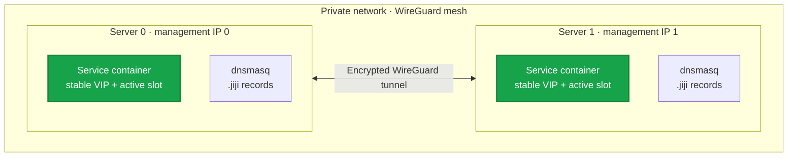

export const metadata = {
  description: 'Reference for Jiji WireGuard networking, private DNS, service addressing, and firewall behavior.',
  alternates: { canonical: '/docs/reference/network' },
  openGraph: { url: '/docs/reference/network', images: ['/docs/opengraph-image.png'] }
}

# Network Reference

Jiji builds a private network between your servers and works it all out up
front from `deploy.yml`, nothing runs to coordinate it at runtime. WireGuard
carries encrypted host-to-host traffic, each host owns a routed container
subnet, `dnsmasq` serves compiled `.jiji` records, and nftables maps stable
per-service VIPs to whichever backend container is currently active.

## Overview



## Multiple projects on one server

Every piece of this network layer is **per-project isolated**, computed
purely from `project:` in `deploy.yml` - there is no shared registry and no
coordination between projects. Two independent projects (different
`project:` names, different `deploy.yml` files) can run `jiji server setup`
against the same physical server, and each gets its own:

- WireGuard interface, port, and keypair
- container-engine bridge network and subnet
- `dnsmasq` resolver process
- compiled state tree under `/etc/jiji/network/{slug}/`
- systemd units

`{slug}` is a short, deterministic, hash-suffixed identifier derived from
`project:` - run `jiji network plan` to see the exact value for your
project. The one intentionally shared, multi-tenant component is
kamal-proxy: one container per host, attached to every project's bridge that
has active routes on that host, with routes namespaced per project.

Because identity is purely name-derived with no registry, **`project:`
names must be unique per host**, not just per config repository - two
projects that happen to share a literal project name are indistinguishable
to jiji. There is also a small, real chance of a hash collision between two
*different* project names that both rely on the default
`network.container_cidr`/`management_cidr` ranges, since both draw their
subnets from the same shared address space. If you expect several projects
on one host, set distinct `network.container_cidr`/`management_cidr` values
per project - distinct ranges make a collision impossible, not just less
likely. `jiji server setup`/`jiji network setup` prints an advisory when a
project is relying on the shared defaults, and rejects with an actionable
error if a real collision is ever detected on a host.

## Commands

```bash
# Print the deterministic plan without changing hosts
jiji network plan

# Install, update, or repair the complete network
jiji network setup

# The full server setup includes the same network workflow
jiji server setup
```

`-H`/`--hosts` limits which hosts are changed, but planning always uses the
complete configured topology.

## Default address ranges

```yaml
network:
  enabled: true
  management_cidr: 198.18.0.0/16
  container_cidr: 100.64.0.0/10
```

These ranges are shared by every configuration that omits explicit overrides. `jiji init` now writes a project-directory-derived `/24` management range and `/16` container range instead. Because the generated container range occupies one of 64 slots, review it for VPN/VPC overlap and rare collisions with other projects before setup.

Management addresses and per-host container subnets are deterministic. Each service endpoint receives a stable VIP plus two fixed backend addresses (A and B). A deploy always brings the candidate container up on the *inactive* slot; once it passes its health check, jiji atomically moves the VIP over to that backend.

Changing either CIDR and running `jiji network setup` performs a project-scoped migration. Jiji detaches the project.s fixed-slot containers and its attachment to the shared proxy, recreates the bridge, reconnects everything at the new planned addresses, and refreshes service mappings, proxy routes, and public ingress. Other projects and named volumes are not touched. If activation fails, Jiji restores the previous bridge and attachment addresses.

## DNS

The aggregate name `{project}-{service}.jiji` resolves to the stable VIPs
for all configured replicas of a service. The name
`{project}-{service}-{server}.jiji` resolves only to that one server's
replica VIP. Both forms are compiled directly from `deploy.yml`, so they
show what's configured rather than what's currently healthy.

```bash
# All replicas of the api service
docker exec <container> getent hosts myapp-api.jiji

# Just the replica on server "web1"
docker exec <container> getent hosts myapp-api-web1.jiji
```

Containers are started with their own project's `dnsmasq` resolver, the
`jiji` search domain, and `ndots:1`. Queries outside `.jiji` are forwarded
through the host resolver. kamal-proxy is the one exception: it's given no
`--dns` at all, since its routing targets are raw backend IP addresses
(never a `.jiji` hostname), and a single resolver can't reliably answer for
every project's `.jiji` records it might be attached to at once.

With Podman, the container queries Aardvark at the bridge gateway. Aardvark
then forwards that container's requests to the project's dnsmasq address.
Netavark can remove dnsmasq's secondary bridge address while activating a
container, so jiji restores the address after every jiji-managed Podman
container start or network attachment. The same repair runs after containers
restart during boot.

## Installed resources

Every path below is rooted under `/etc/jiji/network/{slug}/` - one
independent tree per project, where `{slug}` is that project's derived
identifier (`jiji network plan` prints it). Interface/bridge/unit names
below are similarly derived per project, never fixed literals like `jiji0`.

### Files and services

| Component | Path or unit |
| --- | --- |
| Selected network generation | `/etc/jiji/network/{slug}/current` |
| Retained network generations | `/etc/jiji/network/{slug}/generations/` |
| WireGuard config | `/etc/wireguard/{wireguard_interface}.conf` |
| Selected DNS generation | `/etc/jiji/network/{slug}/dns-current` |
| Retained DNS generations | `/etc/jiji/network/{slug}/dns-generations/` |
| Selected service VIP mapping | `/etc/jiji/network/{slug}/service-nat-current` |
| WireGuard service | `wg-quick@{wireguard_interface}.service` |
| Bridge restoration service | `jiji-network-restore-{slug}.service` |
| VIP restoration service | `jiji-service-nat-{slug}.service` |
| Static DNS service | `jiji-dns-{slug}.service` |

`{wireguard_interface}` is a separate short (`jiji` + 8 hex chars)
identifier from `{slug}`, kept under Linux's 15-character interface name
limit - see `jiji network plan` for the concrete value.

### Derived network names

| Resource | Name |
| --- | --- |
| Docker/Podman logical bridge network | `jiji-{slug}` |
| Linux kernel bridge interface | `jijib{7 hex}` |
| Service VIP nftables table | `jiji_service_nat_{slug_with_underscores}` |

The logical engine network and kernel bridge interface are different
resources with different names. The kernel name is shortened to stay within
Linux's 15-character interface limit. The nftables table replaces hyphens
in `{slug}` with underscores because unquoted nftables identifiers cannot
contain hyphens.

All three names are deterministic and per-project. `{slug}` is a sanitized,
hash-suffixed value derived from `project:`, not just the lowercased project
name. `jiji network plan` prints the WireGuard interface, kernel bridge
interface, and logical bridge network. Derive the nftables name from the
printed slug using the rule above.

## Required firewall access

Allow UDP traffic between the configured server public IP addresses on each
project's WireGuard port (`jiji network plan` prints the exact port - it's
derived per project, somewhere in the range `51820`-`55819`, not always
`51820`). Container subnets are routed only through WireGuard. There is no
separate gossip or database port to open - that layer doesn't exist in this
design.

## Verification

```bash
# Substitute this project's derived interface name and slug (see `jiji network plan`)
sudo wg show <wireguard_interface>
ip route show dev <wireguard_interface>
docker network inspect <bridge-network>
podman network inspect <bridge-network>
ip link show <bridge-interface>
sudo nft list table ip <service-nat-table>
systemctl status jiji-network-restore-<slug> jiji-service-nat-<slug> jiji-dns-<slug>
readlink -f /etc/jiji/network/<slug>/current
readlink -f /etc/jiji/network/<slug>/dns-current
docker exec <container> getent hosts <project>-<service>.jiji
```

Use `podman exec` instead of `docker exec` when Podman is selected.

## Reboot behavior

WireGuard and the jiji systemd units restore the selected local generations
on their own. Containers restart with their assigned backend addresses
according to their engine restart policy. No coordination service, SSH
connection, jiji command, or redeployment is required when topology hasn't
changed.

Jiji's restore service materializes each Podman bridge directly before
containers restart. `podman-restart.service` itself is host-global, gated on
every project's restore unit via one drop-in file per project. This keeps an
empty project network available with no auxiliary container. After Podman
starts the containers, the drop-in restores the project's secondary dnsmasq
address in case Netavark removed it during bridge activation. The drop-in also
starts containers using the `unless-stopped` policy, which Podman 4.9's
packaged restart unit does not start by itself.

## Repair

Run `jiji network setup`. It stages and validates a complete generation on
every selected host before activation. If activation or verification fails,
all attempted hosts roll back to their previous retained generations.
Repairing one project's network never touches another project's tree,
units, or bridge on a shared host.

`jiji deploy` checks every configured host before making deployment changes.
When it detects a stale generation, it automatically applies the complete
network plan to the full cluster using the same transactional setup path.
The explicit command remains available for network-only maintenance.

## Troubleshooting

### WireGuard not connecting

```bash
jiji server exec "sudo wg show <wireguard_interface>"
jiji server exec "sudo systemctl status wg-quick@<wireguard_interface>"
jiji server exec "sudo journalctl -u wg-quick@<wireguard_interface> --since '1 hour ago'"
```

### DNS not resolving

```bash
jiji server exec "sudo systemctl status jiji-dns-<slug>"
jiji server exec "sudo journalctl -u jiji-dns-<slug> -f"
docker exec <container> getent hosts <project>-<service>.jiji
```

With Podman, verify both the project dnsmasq address and resolution through
the container's Aardvark resolver:

```bash
jiji server exec "ip -4 address show dev <bridge-interface>"
jiji server exec "podman exec <container> getent hosts <project>-<service>.jiji"
jiji server exec "podman exec <container> getent hosts example.com"
```

### Containers can't reach each other

```bash
jiji server exec "ip route show dev <wireguard_interface>"
docker exec <container> ip route
docker exec <container> getent hosts <project>-<service>.jiji
```

## Upgrading from a pre-isolation jiji version

Per-project isolation changed the on-disk layout, WireGuard interface name,
and bridge name - every already-provisioned host's installed generation
becomes incompatible with the new version, even for a host that only ever
ran one project. There is no in-place migration: run `jiji server teardown`
against the old layout (or manually remove `/etc/jiji/network`, the old
`jiji0` WireGuard interface, and the old `jiji` bridge network), then run
`jiji server setup` again on the new version.
