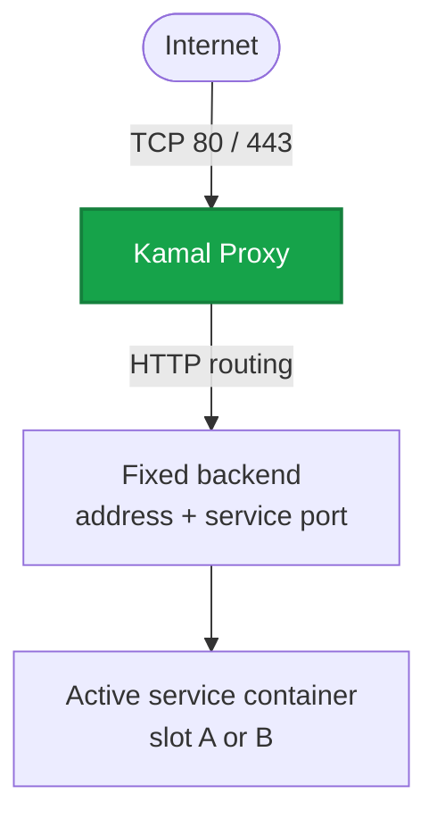

export const metadata = {
  description: 'Configure kamal-proxy routing, domains, TLS certificates, health checks, and zero-downtime traffic switching with Jiji.',
  alternates: { canonical: '/docs/reference/proxy' },
  openGraph: { url: '/docs/reference/proxy', images: ['/docs/opengraph-image.png'] }
}

# Kamal Proxy Reference

Jiji uses Kamal Proxy as the public HTTP and HTTPS entry point for proxied
services. Jiji installs and manages the proxy container, translates each
service's `proxy:` configuration into routes, and updates those routes during
zero-downtime deployments.



## Container

Jiji runs one Kamal Proxy container on each server that needs proxy routes.

| Property | Value |
|---|---|
| Container name | `kamal-proxy` |
| Image | `ghcr.io/acidtib/kamal-proxy:jiji` |
| Restart policy | `unless-stopped` |
| Public ports | `80` and `443` |
| Internal ports | `8080` and `8443` |
| Configuration volume | `kamal-proxy-config` |
| Certificate directory | `/etc/jiji/certs` on the host, mounted read-only at `/jiji-certs` |

The container is labeled `jiji.managed=true`. Jiji pulls the configured image
and replaces the container when its managed configuration is out of date.

With Docker, Kamal Proxy uses the Docker socket. With Podman, it runs with the
host access needed to manage routes through the Podman runtime.

## Shared Per-Host Ownership

Kamal Proxy is shared by every Jiji project on a host. It is the exception to
Jiji's otherwise per-project network isolation:

- There is one `kamal-proxy` container per physical host.
- Route names include the project name.
- The container is attached to every project bridge that has routes on that
  host.
- Each attachment uses that project's deterministic proxy address.
- Routes target numeric backend addresses, so the proxy does not use a
  project's `.jiji` DNS resolver.

Attaching a new project is additive. Jiji does not remove the proxy's existing
project networks when it attaches another one.

This shared ownership matters when restarting the proxy. `jiji proxy restart`
recreates the container and briefly interrupts every route on each selected
host. It also removes other projects' network attachments. Each affected
project restores its attachment the next time it runs `jiji deploy`,
`jiji server setup`, or `jiji proxy restart`.

## Service Configuration

Configure one proxy target directly under a service:

```yaml
services:
  web:
    image: ghcr.io/example/web:latest
    servers: [web1, web2]
    proxy:
      port: 3000
      hosts:
        - example.com
        - www.example.com
      ssl: true
      healthcheck:
        path: /health
        interval: 10s
        timeout: 5s
        deploy_timeout: 60s
```

### Single-target fields

| Field | Description |
|---|---|
| `port` | Port exposed by the service container |
| `hosts` | Hostnames accepted by the route |
| `ssl` | `false` or omitted for HTTP, `true` for TLS, or a custom certificate object |
| `path_prefix` | Optional path prefix used to select the route |
| `healthcheck` | Health-check settings applied when activating the route |

### Multiple targets

Use `targets` when one service exposes more than one proxied port:

```yaml
services:
  storage:
    image: example/storage:latest
    servers: [storage1]
    proxy:
      targets:
        - port: 3900
          hosts: [s3.example.com]
          ssl: true
          healthcheck:
            path: /health
        - port: 3903
          hosts: [admin.example.com]
          ssl: true
          healthcheck:
            path: /health
```

Each target supports `port`, `hosts`, `ssl`, `path_prefix`, and
`healthcheck`. When `targets` is present, it takes precedence over the flat
single-target fields.

## Route Identity

Jiji names each route using:

```text
{project}-{service}-{port}
```

For this configuration:

```yaml
project: storefront

services:
  api:
    proxy:
      port: 3000
      hosts: [api.example.com]
```

the route is named:

```text
storefront-api-3000
```

The route name does not include the server name. Each host has its own local
Kamal Proxy route table, so the same route name on two hosts points to the
backend running on that host.

## Host and Path Routing

Use different `hosts` values for domain-based routing:

```yaml
services:
  web:
    proxy:
      port: 3000
      hosts: [example.com]

  api:
    proxy:
      port: 4000
      hosts: [api.example.com]
```

Use `path_prefix` to share one hostname:

```yaml
services:
  web:
    proxy:
      port: 3000
      hosts: [example.com]

  api:
    proxy:
      port: 4000
      hosts: [example.com]
      path_prefix: /api
```

Longer path prefixes take priority over shorter prefixes. A route without
`path_prefix` acts as the catch-all for its host.

## TLS

Set `ssl: true` to enable TLS for a target:

```yaml
proxy:
  port: 3000
  hosts: [example.com]
  ssl: true
```

Public DNS for every configured hostname must point to the server, and inbound
TCP ports 80 and 443 must be open. Kamal Proxy handles certificate provisioning
for TLS-enabled routes.

The configuration schema also accepts certificate and private-key values:

```yaml
proxy:
  port: 3000
  hosts: [internal.example.com]
  ssl:
    certificate_pem: CERTIFICATE_PEM
    private_key_pem: PRIVATE_KEY_PEM
```

The values can use Jiji's secret resolution. Do not place private key material
directly in a committed configuration file.

## Health Checks and Activation

A proxy health check can use an HTTP path:

```yaml
healthcheck:
  path: /health
  interval: 10s
  timeout: 5s
  deploy_timeout: 60s
```

Or a command executed against the candidate container:

```yaml
healthcheck:
  cmd: "test -f /app/ready"
  cmd_runtime: docker
  interval: 10s
  timeout: 5s
  deploy_timeout: 60s
```

| Field | Description |
|---|---|
| `path` | HTTP endpoint used for the check |
| `cmd` | Command used instead of an HTTP endpoint |
| `cmd_runtime` | `docker` or `podman`; defaults to `builder.engine` |
| `interval` | Delay between health-check attempts |
| `timeout` | Timeout for one check; defaults to `5s` during proxy activation |
| `deploy_timeout` | Maximum time allowed for proxy activation; defaults to `30s` |

During a deployment, Jiji:

1. Starts the candidate on the inactive fixed backend address.
2. Health-checks the candidate directly.
3. Moves the service VIP to the candidate.
4. Updates the Kamal Proxy route to the candidate's backend address.
5. Verifies that the route exists.
6. Removes the previous container.

Proxy activation has an outer process timeout five seconds longer than
`deploy_timeout`. If route activation or verification fails, Jiji restores the
previous VIP and proxy route, then removes the failed candidate.

Use `--skip-proxy` with `jiji deploy` only when an external system manages
public routing. It skips both proxy readiness and route activation.

## Commands

### View logs

```bash
jiji proxy logs
jiji proxy logs --since 30m
jiji proxy logs --grep "error"
jiji proxy logs -H web1 --follow
```

| Option | Description |
|---|---|
| `-n, --lines <N>` | Number of lines to show; defaults to 100 when no other filter is used |
| `-s, --since <time>` | Show entries since a timestamp or relative duration |
| `-g, --grep <pattern>` | Filter log lines |
| `-f, --follow` | Follow logs; requires exactly one selected host |
| `-H, --hosts <pattern>` | Select hosts |

Proxy logs are host-scoped. `-S`/`--services` is rejected.

### Restart

```bash
jiji proxy restart
jiji proxy restart -H web1
```

Restart pulls the image and recreates Kamal Proxy on each selected host.
Because the proxy is shared, `-S`/`--services` is rejected.

## Network and Public Ingress

With private networking enabled, Kamal Proxy is attached to each project's
bridge at the deterministic proxy address shown by `jiji network plan`.
Routes point directly to the active backend slot address and service port.

Docker can ignore IPv4 port publishing when Jiji's routed bridge disables
masquerading. Jiji compensates with a host-level nftables table named
`jiji_proxy_ingress` and restores it at boot with
`jiji-proxy-ingress-restore.service`. This workaround is host-global because
the proxy itself is host-global. Podman does not use this workaround.

## Lifecycle and Teardown

`jiji server setup` installs or repairs Kamal Proxy. Deploy, service restart,
and service rollback also verify that it is running before changing routes.

During `jiji server teardown`, Jiji removes only the selected project's
routes and bridge attachment. The shared container, configuration volume,
certificates, and public-ingress rule are removed only when no route for any
project remains on the host.

## Troubleshooting

Check proxy state and recent logs:

```bash
jiji proxy logs --since 15m
jiji server exec "docker inspect kamal-proxy"
jiji server exec "docker logs --tail 100 kamal-proxy"
```

Use `podman` in the remote commands when Podman is configured.

If a route does not receive traffic:

1. Confirm public DNS points to the intended server.
2. Confirm TCP ports 80 and 443 are open.
3. Check `jiji proxy logs` for routing or certificate errors.
4. Check the service health endpoint directly.
5. Run `jiji network plan` and verify the proxy is attached to the expected
   project bridge.
6. Run `jiji network setup` to repair project networking.

If Kamal Proxy is attached to the right bridge with the wrong address, Jiji
reports address drift instead of changing it silently. Remove the proxy
container and rerun `jiji server setup`, or investigate the network plan
before recreating it.
