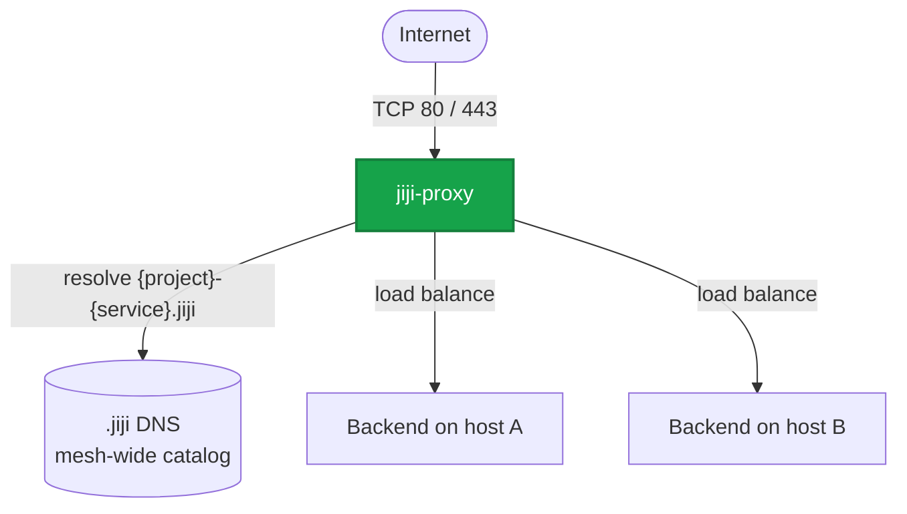

export const metadata = {
  description: 'Configure jiji-proxy HTTP, HTTPS, and raw TCP routing, TLS certificates, health checks, and zero-downtime traffic switching with Jiji.',
  alternates: { canonical: '/docs/reference/proxy' },
  openGraph: { url: '/docs/reference/proxy', images: ['/docs/opengraph-image.png'] }
}

# Jiji Proxy Reference

Jiji uses **jiji-proxy**, its own Pingora-based (Rust) reverse proxy, as the
public HTTP, HTTPS, and raw TCP entry point for proxied services. Jiji installs
and manages the proxy container, translates each service's `proxy:`
configuration into a route definition, and jiji-proxy continuously discovers
that route's backends over DNS rather than being told an address on every
deploy.



## Container

Jiji runs one jiji-proxy container on each server that needs proxy routes.

| Property | Value |
|---|---|
| Container name | `jiji-proxy` |
| Image | `ghcr.io/acidtib/jiji-proxy:jiji` |
| Restart policy | `unless-stopped` |
| Public ports | `80` and `443` |
| Internal ports | `8080` and `8443` |
| Configuration | `/etc/jiji/proxy/config.yml` on the host, mounted read-only |
| Certificate directory | `/etc/jiji/certs` on the host, mounted read-write |

The container is labeled `jiji.managed=true`. Jiji pulls the configured image
and replaces the container when its managed configuration is out of date.
Unlike some reverse proxies, jiji-proxy needs no Docker/Podman socket access
and no engine-specific runtime privileges: it only ever talks to a project's
`.jiji` DNS resolver and to backend addresses directly, so its container
configuration is identical on Docker and Podman.

## Shared Per-Host Ownership

jiji-proxy is shared by every Jiji project on a host. It is the exception to
Jiji's otherwise per-project network isolation:

- There is one `jiji-proxy` container per physical host.
- The container is attached to every project bridge that has routes on that
  host.
- Each attachment uses that project's deterministic proxy address.
- Routes resolve backend addresses over DNS at the project's own `.jiji`
  resolver, never a hardcoded address.

Attaching a new project is additive. Jiji does not remove the proxy's existing
project networks when it attaches another one.

This shared ownership matters when restarting the proxy. `jiji proxy restart`
recreates the container and briefly interrupts every route on each selected
host. It also removes other projects' network attachments. Each affected
project restores its attachment the next time it runs `jiji deploy`,
`jiji server setup`, or `jiji proxy restart`.

## Service Configuration

Configure one proxy target directly under a service:

```yaml
services:
  web:
    image: ghcr.io/example/web:latest
    servers: [web1, web2]
    proxy:
      port: 3000
      hosts:
        - example.com
        - www.example.com
      ssl: true
      healthcheck:
        path: /health
        interval: 10s
        timeout: 5s
```

### Single-target fields

| Field | Description |
|---|---|
| `port` | Port exposed by the service container |
| `hosts` | Hostnames accepted by the route |
| `ssl` | `false` or omitted for HTTP, `true` for TLS, or a custom certificate object |
| `path_prefix` | Optional path prefix used to select the route |
| `listen_port` | Public port for raw TCP mode; cannot be combined with `path_prefix` or `ssl` |
| `healthcheck` | Active health-check settings jiji-proxy runs continuously against this route's backends |

### Multiple targets

Use `targets` when one service exposes more than one proxied port:

```yaml
services:
  storage:
    image: example/storage:latest
    servers: [storage1]
    proxy:
      targets:
        - port: 3900
          hosts: [s3.example.com]
          ssl: true
          healthcheck:
            path: /health
        - port: 3903
          hosts: [admin.example.com]
          ssl: true
          healthcheck:
            path: /health
```

Each target supports `port`, `hosts`, `ssl`, `path_prefix`, `listen_port`,
and `healthcheck`. When `targets` is present, it takes precedence over the
flat single-target fields.

## Raw TCP Proxying

Set `listen_port` to expose a non-HTTP service through jiji-proxy. The proxy
accepts TCP connections on that public port and relays bytes to healthy
backends discovered through the service's aggregate `.jiji` DNS record.

```yaml
services:
  postgres:
    image: postgres:18
    servers: [db1, db2]
    proxy:
      port: 5432
      listen_port: 15432
      healthcheck:
        cmd: "pg_isready -U appuser -d app"
        interval: 10s
        deploy_timeout: 60s
```

`port` is the backend container port. `listen_port` is the public port on
every ingress server that owns the route, and the two values may differ.
Open `listen_port` in each server's firewall before connecting clients.

Raw TCP routes have no HTTP Host header, path, or TLS handling:

- `path_prefix` and `ssl` cannot be combined with `listen_port`.
- `hosts` is optional metadata and does not select a route.
- Ports `0`, `80`, and `443` cannot be used as `listen_port` values.
- Every TCP route needs a unique `listen_port` within a project.
- Because jiji-proxy is shared, projects on the same host must also use
  different public TCP ports. A cross-project conflict is rejected when the
  route is applied.

Use `targets` to combine HTTP and raw TCP endpoints or publish several TCP
ports from one service:

```yaml
services:
  gateway:
    image: example/gateway:latest
    servers: [edge1, edge2]
    proxy:
      targets:
        - port: 8080
          hosts: [gateway.example.com]
          ssl: true
        - port: 9000
          listen_port: 19000
```

Deployments verify that the new backend appears healthy on the TCP route
before retiring the previous deployment, using the same catalog-driven
rollout model as HTTP routes.

## Route Identity and Backend Discovery

An HTTP route is identified by the `hosts`/`path_prefix` you configure, while
a raw TCP route is identified by `listen_port`. jiji-proxy pushes no explicit
backend address into either route: instead it continuously resolves the
service's **aggregate** DNS name,

```text
{project}-{service}.jiji
```

against the project's own `.jiji` resolver, and load-balances across
whatever healthy addresses that name currently answers with. For this
configuration:

```yaml
project: storefront

services:
  api:
    proxy:
      port: 3000
      hosts: [api.example.com]
```

the route on `api.example.com` resolves backends from `storefront-api.jiji`.

Because discovery is mesh-wide (every host's agent replicates the same
service catalog), **jiji-proxy load-balances across every host running a
healthy replica of the service, not just the host it's running on.** A
request landing on any server's jiji-proxy can be routed to a backend on a
different server entirely. This is a deliberate change from Jiji's earlier
proxy: point public DNS at any server that runs jiji-proxy, not only ones
that happen to run a local replica.

## Host and Path Routing

Use different `hosts` values for domain-based routing:

```yaml
services:
  web:
    proxy:
      port: 3000
      hosts: [example.com]

  api:
    proxy:
      port: 4000
      hosts: [api.example.com]
```

Use `path_prefix` to share one hostname:

```yaml
services:
  web:
    proxy:
      port: 3000
      hosts: [example.com]

  api:
    proxy:
      port: 4000
      hosts: [example.com]
      path_prefix: /api
```

Longer path prefixes take priority over shorter prefixes. A route without
`path_prefix` acts as the catch-all for its host.

## Wildcard Subdomains

A `hosts` entry may be a single-label wildcard:

```yaml
proxy:
  port: 3000
  hosts: ["*.example.com"]
```

`*.example.com` matches any single subdomain level -
`foo.example.com` and `bar.example.com` both match. It does **not** match a
nested subdomain (`deep.foo.example.com`) or the bare domain
(`example.com`) itself. An exact `hosts` entry always takes priority over a
matching wildcard, so `hosts: [api.example.com, "*.example.com"]` routes
`api.example.com` to its own target even though `*.example.com` would also
match it.

Wildcard hosts cannot use `ssl: true`: jiji-proxy's automatic certificate
provisioning only performs HTTP-01 challenges, which cannot issue a
wildcard certificate (that requires DNS-01). Jiji rejects `ssl: true` on a
wildcard host at config-validation time. A wildcard host can still serve
HTTPS with a certificate you provide yourself:

```yaml
proxy:
  port: 3000
  hosts: ["*.example.com"]
  ssl:
    certificate_pem: CERTIFICATE_PEM
    private_key_pem: PRIVATE_KEY_PEM
```

## TLS

Set `ssl: true` to enable TLS for a target:

```yaml
proxy:
  port: 3000
  hosts: [example.com]
  ssl: true
```

Public DNS for every configured hostname must point to a server running
jiji-proxy, and inbound TCP ports 80 and 443 must be open. jiji-proxy handles
certificate provisioning through its own built-in ACME client (HTTP-01
challenges only), issuing and renewing certificates automatically for any
host with at least one TLS-enabled route.

The configuration schema also accepts certificate and private-key values:

```yaml
proxy:
  port: 3000
  hosts: [internal.example.com]
  ssl:
    certificate_pem: CERTIFICATE_PEM
    private_key_pem: PRIVATE_KEY_PEM
```

Jiji writes these straight into jiji-proxy's certificate directory before the
route is applied, so jiji-proxy serves them as-is and never attempts ACME
issuance for that host. The values can use Jiji's secret resolution. Do not
place private key material directly in a committed configuration file.

## Health Checks and Activation

A proxy health check can use an HTTP path:

```yaml
healthcheck:
  path: /health
  interval: 10s
  timeout: 5s
  deploy_timeout: 60s
```

Or a command executed against the candidate container, checked only before a
new deployment is admitted:

```yaml
healthcheck:
  cmd: "test -f /app/ready"
  cmd_runtime: docker
  interval: 10s
  timeout: 5s
  deploy_timeout: 60s
```

| Field | Description |
|---|---|
| `path` | HTTP endpoint jiji-proxy checks continuously against every discovered backend |
| `interval` | Delay between jiji-proxy's own health-check attempts |
| `timeout` | Timeout for one jiji-proxy check |
| `cmd` | Command used instead of `path` for Jiji's own pre-activation gate |
| `cmd_runtime` | `docker` or `podman`; defaults to `builder.engine` |
| `deploy_timeout` | Maximum time allowed for both the pre-activation gate and proxy activation; defaults to `30s` |

`path` and `cmd` serve two different checks with two different scopes.
`path` becomes jiji-proxy's own *ongoing* health check, run on its own
schedule (`interval`/`timeout`) against every backend it discovers over DNS
for that route, mesh-wide: a backend that starts failing mid-interval is
evicted from load balancing without waiting for the next deploy. `cmd` is
never translated to jiji-proxy: it only ever configures Jiji's own
pre-activation gate, the check that runs directly against a fresh candidate
container before it is admitted at all, because execing into a container
only works when the checker and the container are on the same host, an
assumption jiji-proxy's mesh-wide routing can no longer make. A `healthcheck:`
block with only `cmd` set still enables jiji-proxy's own check as a
TCP-only probe. Omit `healthcheck:` entirely and jiji-proxy relies on DNS
re-resolution alone to notice a backend has disappeared.

During a deployment, Jiji:

1. Allocates an address lease and starts a unique Candidate deployment.
2. Health-checks the candidate directly at its own address (`cmd`, or an
   engine-native readiness check if no `healthcheck:` is configured).
3. Publishes the candidate Active in the replicated catalog. This is what
   makes the candidate's address resolvable at all, since jiji-proxy
   discovers backends by resolving DNS against this same catalog.
4. Re-applies the route's (unchanged) definition, forcing jiji-proxy to
   re-resolve immediately instead of waiting out its normal refresh
   interval, then polls jiji-proxy directly until it reports the
   candidate's address as a healthy backend.
5. Drains the previous deployment and releases its lease.

If route verification fails, Jiji tombstones the failed candidate and
releases its lease; the previous deployment was never touched and keeps
serving traffic throughout.

Use `--skip-proxy` with `jiji deploy` only when an external system manages
public routing. It skips proxy readiness verification entirely.

## Commands

### View logs

```bash
jiji proxy logs
jiji proxy logs --since 30m
jiji proxy logs --grep "error"
jiji proxy logs -H web1 --follow
```

| Option | Description |
|---|---|
| `-n, --lines <N>` | Number of lines to show; defaults to 100 when no other filter is used |
| `-s, --since <time>` | Show entries since a timestamp or relative duration |
| `-g, --grep <pattern>` | Filter log lines |
| `-f, --follow` | Follow logs; requires exactly one selected host |
| `-H, --hosts <pattern>` | Select hosts |

Proxy logs are host-scoped. `-S`/`--services` is rejected.

### Restart

```bash
jiji proxy restart
jiji proxy restart -H web1
```

Restart pulls the image and recreates jiji-proxy on each selected host.
Because the proxy is shared, `-S`/`--services` is rejected.

## Network and Public Ingress

With private networking enabled, jiji-proxy is attached to each project's
bridge at the deterministic proxy address shown by `jiji network plan`.
Routes resolve backend addresses from the project's own `.jiji` DNS at the
address and interval jiji-proxy was configured with (see "Route Identity
and Backend Discovery" above).

Because discovery is mesh-wide, public DNS can point at any server running
jiji-proxy for the project, regardless of whether that specific server also
runs a replica of the service. If every server currently eligible to run a
service happens to be unreachable or unhealthy, jiji-proxy simply has no
healthy backend to route to and returns an error until one recovers.

Docker can ignore IPv4 port publishing when Jiji's routed bridge disables
masquerading. Jiji compensates with a host-level nftables table named
`jiji_proxy_ingress`. Whichever co-resident project's agent currently holds
the host-level ingress lease reapplies this table on every reconcile tick -
there is no separate boot-time restore unit, so ingress self-heals
continuously rather than only after a reboot. This workaround is host-global
because the proxy itself is host-global. Podman does not use this
workaround.

## Lifecycle and Teardown

`jiji server setup` installs or repairs jiji-proxy. Deploy, service restart,
and service rollback also verify that it is running before changing routes.

During `jiji server teardown`, Jiji removes only the selected project's
routes and bridge attachment. The shared container, certificates, and
public-ingress rule are removed only when no route for any project remains
on the host. `jiji-agent` is stopped before any of this, so its own
continuous reconciliation can't reapply a route or recreate the proxy
container behind the teardown's back.

## Troubleshooting

Check proxy state and recent logs:

```bash
jiji proxy logs --since 15m
jiji server exec "docker inspect jiji-proxy"
jiji server exec "docker logs --tail 100 jiji-proxy"
jiji server exec "docker exec jiji-proxy jiji-proxy route list"
jiji server exec "docker exec jiji-proxy jiji-proxy route status --host example.com"
jiji server exec "docker exec jiji-proxy jiji-proxy tcp-route list"
jiji server exec "docker exec jiji-proxy jiji-proxy tcp-route status --listen-port 15432"
```

Use `podman` in the remote commands when Podman is configured. `route list`
shows every HTTP route currently configured on that host's jiji-proxy;
`route status --host <host>` shows the backend addresses it has discovered
for that route and whether each one passes its health check. Use the
corresponding `tcp-route` commands for raw TCP routes.

If a route does not receive traffic:

1. Confirm public DNS points to a server running jiji-proxy for the project.
2. Confirm TCP ports 80 and 443 are open for HTTP routes, or that the
   configured `listen_port` is open for a raw TCP route.
3. Check `jiji proxy logs` for routing or certificate errors.
4. Run `route status --host <host>` (above) to see whether jiji-proxy has
   discovered any healthy backend for the route at all.
5. Check the service health endpoint directly.
6. Run `jiji network plan` and verify the proxy is attached to the expected
   project bridge.
7. Run `jiji network setup` to repair project networking.

If jiji-proxy is attached to the right bridge with the wrong address, Jiji
reports address drift instead of changing it silently. Remove the proxy
container and rerun `jiji server setup`, or investigate the network plan
before recreating it.
