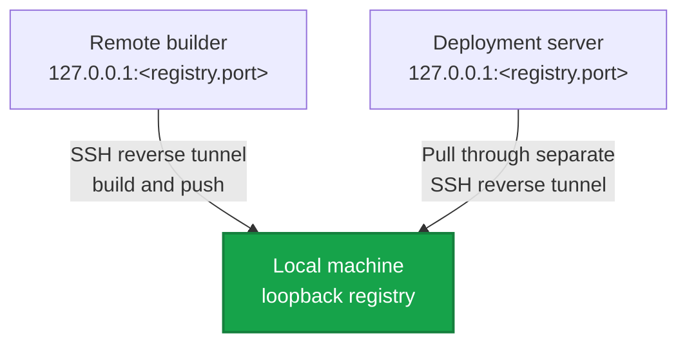

export const metadata = {
  description: 'Configure container registries, authentication, image publishing, and the optional Jiji local registry.',
  alternates: { canonical: '/docs/reference/registry' },
  openGraph: { url: '/docs/reference/registry', images: ['/docs/opengraph-image.png'] }
}

# Registry Reference

Jiji auto-detects namespace requirements for the registries below, so
configuration stays minimal.

## Supported Registries

### GitHub Container Registry (GHCR)

```yaml
builder:
  registry:
    server: ghcr.io
    username: your-github-username
    password: GITHUB_TOKEN
```

Auto namespace: `username/project-name`. Images push to
`ghcr.io/your-github-username/project-name/service:version`.

Create a token at [github.com/settings/tokens](https://github.com/settings/tokens)
with `write:packages` and `read:packages`, then `export
GITHUB_TOKEN=ghp_...` (or point `password` at that name and put it in your
`.env`).

### Docker Hub

```yaml
builder:
  registry:
    server: docker.io
    username: your-dockerhub-username
    password: DOCKER_PASSWORD
```

Auto namespace: `username`. Images push to
`docker.io/your-dockerhub-username/project-service:version`.

### Custom registry

```yaml
builder:
  registry:
    server: registry.example.com:5000
    username: myuser
    password: REGISTRY_PASSWORD
```

No auto namespace. Images push to
`registry.example.com:5000/project-service:version`.

### AWS ECR / GCP Artifact Registry

Set an explicit `server`, as with any custom registry. Both providers issue
short-lived credentials, so `password:`
uses the `$(...)` command-value syntax to fetch a fresh one on every run
(runs locally through a shell, uses the trimmed stdout, 30 second timeout)
instead of a stale value going into `.env`:

```yaml
builder:
  registry:
    server: <account-id>.dkr.ecr.<region>.amazonaws.com
    username: AWS
    password: "$(aws ecr get-login-password --region <region>)"
```

```yaml
builder:
  registry:
    server: <region>-docker.pkg.dev
    username: _json_key_base64
    password: "$(base64 -w0 service-account-key.json)"
```

### Local registry

```yaml
builder:
  registry:
    port: 31270 # optional, defaults to 31270
```

No namespace, no credentials. Images are stored at
`localhost:31270/project-service:version` - see "Local Registry Details"
below for how it reaches remote servers.

## Registry Password

`password` can be a literal value, an ALL_CAPS secret name resolved the
same way as everywhere else in config (from `.env`, or host environment
with `--host-env`), or `$(a local command)` - see "AWS ECR / GCP Artifact
Registry" above:

```yaml
builder:
  registry:
    password: GITHUB_TOKEN
```

The password is sent to the container engine over stdin only. It's never
placed in a command string, logged, or printed.

## Registry Commands

`jiji build` and `jiji deploy --build` authenticate automatically:
remote registries locally before pushing, and on every selected deployment
host before pulling. Local registries need no credentials.

To authenticate or clear credentials explicitly:

```bash
jiji registry login
jiji registry login --skip-local    # servers only
jiji registry login --skip-remote   # local machine only

jiji registry logout
jiji registry logout --skip-local
jiji registry logout --skip-remote
```

By default both commands act on the local machine, then every `-H`-selected
server (all configured servers if `-H` is omitted). `jiji registry login`
requires `server`, `username`, and `password` to be set.
`jiji registry logout` only needs `server`, and is idempotent - an engine
reporting "already logged out" counts as success. `-S`/`--services` is
rejected for both: registry credentials belong to a host's container
engine, not an individual service. Both commands try every requested
target even if one fails, then exit nonzero if any target failed.

Remove the local registry container with:

```bash
jiji registry teardown
jiji registry teardown --dry-run
jiji registry teardown --yes
```

Teardown verifies jiji's ownership label and the configured port before
removing the `jiji-registry` container, and refuses to touch anything that
doesn't match.

## Local Registry Details

### How it works



For a local build and deploy:

1. Starts or reuses the loopback-bound `jiji-registry` container
2. Builds and pushes versioned images to `localhost:31270`
3. Opens SSH connections to selected deployment servers and creates
   reverse tunnels (`remote 127.0.0.1:31270 -> local 127.0.0.1:31270`)
4. Each server pulls the newly built image
5. Tunnels are torn down after the deploy; the registry container itself
   keeps running for the next build

When `builder.remote` is set, there are two independent tunnel phases:

1. Jiji binds `127.0.0.1:<registry.port>` on the remote builder through
   SSH. Build and push commands on the builder use that loopback address to
   reach the registry on the operator machine.
2. The builder tunnel is cleaned up with the remote build session.
3. During deployment, Jiji separately binds the configured port on each
   selected deployment server so its engine can pull the image.

The builder needs no inbound access to the operator machine, and the
registry is never publicly exposed. The SSH servers must permit remote
forwarding, but every forwarded listener remains loopback-only, so
`GatewayPorts` is not required.

The builder-side port is fixed. Concurrent remote builds using the same
builder and local-registry port compete for that one loopback listener.
Jiji reports the bind conflict and does not replace the existing listener
or automatically select another port. Serialize those builds, or configure
distinct registry ports for independent invocations.

The registry container is labeled as jiji-managed. If `jiji-registry`
already refers to something else, or its recorded port doesn't match your
config, jiji stops and asks you to resolve the conflict rather than
guessing.

### Advantages

- No external registry account needed for local development
- No push/pull round trip to a remote registry
- Works fully offline
- Traffic is encrypted over the SSH tunnel

### Troubleshooting

**A host can't connect to `localhost:<registry.port>`:**

```bash
# Local operator: confirm the registry is running
curl http://127.0.0.1:<registry.port>/v2/

# Remote builder, during a remote build
ss -tlnp | grep <registry.port>

# Deployment server, during a deployment
ss -tlnp | grep <registry.port>
```

On the builder or deployment server, check that `sshd_config` allows remote
forwarding:

```
AllowTcpForwarding yes
```

Jiji binds the forwarded port to the remote host's `127.0.0.1` only.
`GatewayPorts` is not required, and shouldn't be enabled just for jiji -
it would expose the forwarded registry on non-loopback interfaces.

## Remote Registry Authentication

### Per-environment credentials

```yaml
# jiji.staging.yml
builder:
  registry:
    server: ghcr.io
    username: myorg
    password: STAGING_GITHUB_TOKEN
```

```yaml
# jiji.production.yml
builder:
  registry:
    server: ghcr.io
    username: myorg
    password: PRODUCTION_GITHUB_TOKEN
```

### CI/CD

```yaml
# GitHub Actions example
- name: Deploy
  env:
    GITHUB_TOKEN: ${{ secrets.GITHUB_TOKEN }}
  run: jiji deploy -y
```

Never commit `.env` files - add `.env*` to `.gitignore`, and keep separate
tokens per environment.

## Troubleshooting

**GHCR 403 Forbidden:** confirm the token has `write:packages`, the
username matches the GitHub user/org, and the token can create packages
under that namespace.

**"GHCR requires username to be configured":** add `username` to
`builder.registry` - GHCR and Docker Hub both need it for automatic
namespace detection.
